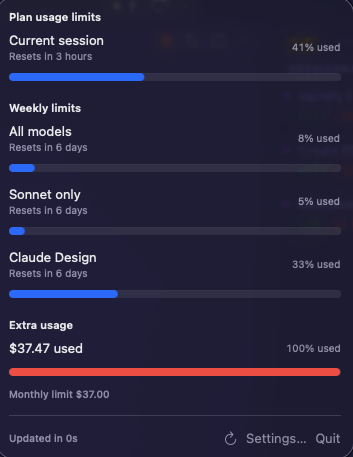
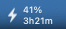
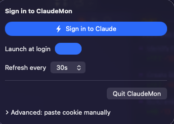

# ClaudeMon

[](https://github.com/gltorres/macos-claude-code-monitoring/actions/workflows/ci.yml)
[](LICENSE)
[](https://github.com/gltorres/macos-claude-code-monitoring/releases)
[](https://www.apple.com/macos/)

> **Status: experimental (v0.1.0).** Unofficial — not affiliated with, endorsed
> by, or supported by Anthropic. The app reads an undocumented endpoint via
> your browser session cookie; Anthropic may change or restrict that endpoint
> at any time. The "Daily routine runs", "Claude Design weekly", and
> "Extra usage" buckets are placeholders pending schema verification (see
> [Schema verification](#schema-verification)). Prefer the
> [official usage page](https://claude.ai/settings/usage) for anything
> billing-relevant.

A native macOS menu bar app that mirrors the usage data shown at
[claude.ai/settings/usage](https://claude.ai/settings/usage) — current 5-hour
session, weekly all-models, weekly Sonnet-only, Claude Design, daily routine
runs, and extra-usage spend — driven by your `sessionKey` cookie.

The app lives next to the system clock, shows a small `bolt` icon with an
optional `NN%` overlay when the highest tracked bucket is `>= 10%`, and opens
a Docker-Desktop-style popover with progress bars on click.

<p align="center">
  
</p>

<p align="center">
  
  &nbsp; menu-bar indicator with the highest active bucket overlaid.
</p>

## Run locally

### 1. Prerequisites

- macOS 14.0 or newer
- Xcode 15+ (16 or 26 also work) with the Command Line Tools installed
- [`xcodegen`](https://github.com/yonaskolb/XcodeGen):

  ```bash
  brew install xcodegen
  ```

### 2. Clone and generate the Xcode project

```bash
git clone git@github.com:gltorres/macos-claude-code-monitoring.git
cd macos-claude-code-monitoring
xcodegen generate
```

`xcodegen` reads `project.yml` and produces `ClaudeMon.xcodeproj`. Re-run it
any time `project.yml` changes.

### 3a. Run from Xcode (recommended for development)

```bash
open ClaudeMon.xcodeproj
```

Select the **ClaudeMon** scheme (top-left of the Xcode toolbar) and press
`Cmd-R`. The bolt icon appears in your menu bar; click it to open the popover.

### 3b. Run from the command line (no Xcode UI)

Build a Debug binary with ad-hoc signing:

```bash
xcodebuild -project ClaudeMon.xcodeproj -scheme ClaudeMon \
    -configuration Debug build \
    CODE_SIGN_IDENTITY=- CODE_SIGNING_REQUIRED=NO CODE_SIGNING_ALLOWED=NO
```

Then launch the produced `.app`:

```bash
open "$(xcodebuild -project ClaudeMon.xcodeproj -scheme ClaudeMon \
    -configuration Debug -showBuildSettings \
    | awk '/ BUILT_PRODUCTS_DIR /{print $3}')/ClaudeMon.app"
```

### 4. Sign in

Click the bolt icon → **Sign in to Claude**. A small browser window opens
at `https://claude.ai/login`; sign in as you normally would. The window
closes itself once your session is captured, and the popover starts showing
live usage within ~5 seconds.

<p align="center">
  
</p>

<details>
<summary>Advanced: paste a cookie manually</summary>

If you'd rather paste the `sessionKey` cookie yourself (e.g. you're scripting
the install), open the popover → **Advanced: paste cookie manually**, then
follow the DevTools steps at <https://claude.ai/settings/usage>:

1. Sign in to [claude.ai](https://claude.ai) in Chrome or Safari.
2. Open DevTools (`Option-Cmd-I`).
3. **Application** tab → **Storage** → **Cookies** → `https://claude.ai`.
4. Find the row named `sessionKey`, double-click its **Value**, copy it
   (it starts with `sk-ant-sid01-`).
5. Paste into the Advanced field → **Save**.

</details>

### 5. Run the tests

```bash
xcodebuild -project ClaudeMon.xcodeproj -scheme ClaudeMon \
    -destination 'platform=macOS' test
```

## Build a release DMG

For an unsigned local DMG (will trip Gatekeeper on other Macs — recipients
must right-click → Open or run
`xattr -dr com.apple.quarantine /Applications/ClaudeMon.app`):

```bash
xcodebuild -project ClaudeMon.xcodeproj -scheme ClaudeMon \
    -configuration Release -derivedDataPath .build/dd build
hdiutil create -volname ClaudeMon -srcfolder \
    .build/dd/Build/Products/Release/ClaudeMon.app \
    -ov -format UDZO .build/ClaudeMon.dmg
```

For a notarized release DMG see `scripts/build-release.sh` (requires an
Apple Developer ID and an `AC_NOTARY` keychain profile created via
`xcrun notarytool store-credentials`).

## Schema verification

The fields read from `GET /api/organizations/{uuid}/usage` are *placeholders*
until verified against the real response. The five-hour and seven-day buckets
are corroborated by multiple open-source projects, but the "Claude Design"
weekly bucket, "Daily routine runs", and "Extra usage" object are not publicly
documented. To verify:

1. Chrome DevTools → **Network** tab → filter Fetch/XHR → check **Preserve
   log**.
2. Visit `https://claude.ai/settings/usage`.
3. For every request whose path starts with `/api/`, copy the URL and the
   response body to a scratch file.
4. Map the captured field names to the placeholders in
   `ClaudeMon/Models/UsageSnapshot.swift` (search for `TODO` comments) and
   adjust the `CodingKeys` enum.

The Codable model uses optionals everywhere, so unknown fields silently
degrade to "—" rather than crashing the app.

## Privacy & security

- Your `sessionKey` is stored only in the macOS Keychain
  (`app.claudemon.ClaudeMon` / `claude-ai-session-key`, accessibility
  `kSecAttrAccessibleAfterFirstUnlockThisDeviceOnly`).
- The app makes one HTTPS GET per minute to `claude.ai/api/organizations`
  and `claude.ai/api/organizations/{uuid}/usage`. No data is sent anywhere
  else.
- Sandboxed with App Sandbox + `com.apple.security.network.client` only.
- Verify Keychain presence with
  `security find-generic-password -s app.claudemon.ClaudeMon`.

## Polling cadence

The app polls every 60 seconds by default (configurable via the
`refreshIntervalSeconds` `UserDefaults` key, hard-floored at 30s and capped
at 600s). The lower bound is intentional: claude.ai enforces against
automated access, and a 60s cadence is well within the read-only safe range
used by similar open-source projects.

## Manual smoke test

Before each release the maintainer walks through
[`docs/manual-smoke-test.md`](docs/manual-smoke-test.md). Native AppKit
popovers cannot be exercised by Playwright; XCUITest is a follow-up.

## Troubleshooting

- **`xcodegen: command not found`** — install with `brew install xcodegen`.
- **Bolt icon never appears** — confirm `LSUIElement` is `YES` in the built
  `Info.plist` (set via `project.yml`); if you ran a stale build, delete
  `ClaudeMon.xcodeproj` and re-run `xcodegen generate`.
- **`Session expired` banner immediately after pasting the key** — the
  cookie is wrong or expired. Re-copy from DevTools (whole value, no quotes,
  no leading/trailing whitespace) and ensure it starts with `sk-ant-sid01-`.
- **Numbers stuck at "—"** — open Console.app, filter by `ClaudeMon`, and
  inspect the latest network log line. Most likely the response schema has
  drifted; see the *Schema verification* section.

## License

MIT.
